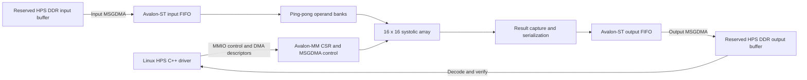

# INT8 Systolic Array Coprocessor on Agilex 5

A VHDL matrix multiplication accelerator with a Linux C++ host driver, integrated into a Terasic DE25 Standard Intel Agilex 5 FPGA SoC. The design computes **C = A × B** using **signed INT8 operands and INT32 accumulation** on a **16×16 array of 256 processing elements**.

The project extends a fixed 4×4 prototype into a tiled accelerator capable of processing matrices larger than the physical array. It combines hardware accumulation, runtime dimension controls, ping-pong operand banks, Avalon interfaces, DMA, and HPS software. Board validation covers irregular matrices, signed extremes, tile boundaries, and square workloads through **1024×1024**.

## Project at a glance

| Item | Implementation or measured result |
|---|---|
| Platform | Terasic DE25 Standard, Agilex 5 `A5ED013BB32AE4SCS` |
| Accelerator | 16×16 systolic array, 256 multiply-accumulate processing elements |
| Arithmetic | Signed INT8 inputs, INT32 partial sums and output |
| Fabric clock used for performance calculations | 100 MHz |
| Host | ARM Cortex-A55 running Linux; C++17 application |
| Interfaces | Avalon-MM control registers and 32-bit Avalon-ST data paths |
| Data movement | Input/output MSGDMA engines and reserved HPS DDR |
| Arithmetic mapping | ALM-based multiplication; zero DSP blocks in the 16×16 fitter summaries |
| Correctness campaign | **112 test points, 3,360 measured runs, 336 warmups, zero mismatches** |
| Largest verified square workload | M = K = N = 1024, signed random inputs |
| 1024³ median FPGA driver wall time | **15.254 seconds** |
| 1024³ useful wall throughput | **0.1408 GOPS** |
| Execution schedule measured | Sequential HPS tile submission; full RTL overlap benefit is not measured |

**Main result:** tiled signed GEMM is correct across the tested shapes and sizes. Useful wall throughput increases with square size and approaches a plateau through 1024. Completion waits and packing dominate application latency. The current FPGA driver remains slower than the scalar CPU reference in the measured large sweep; no speedup over an optimized CPU library is claimed.

## Design evolution and engineering decisions

The baseline is a **4×4 array at 50 MHz**, tested through the JTAG Master Bridge. It executes independent tiles with one operand bank and one result snapshot. Its hardware counter records **44 cycles**, equivalent to **0.880 microseconds** for 128 useful operations. That interval includes loading and capture, whereas the current array counter excludes those stages. The two counter rates therefore do not establish an application speedup.

### Phase 1 — Tiling and block accumulation (`CFG_ACCUMULATE`)

**Change:** the HPS driver decomposes a matrix into 16×16 tiles, while the array retains partial sums across the K dimension.

**Reason:** a fixed array cannot process a large GEMM as one invocation. For each output tile, the products from successive K tiles must contribute to the same result. Retaining those sums in hardware avoids transferring every partial result to the CPU for accumulation.

The driver enables `CFG_ACCUMULATE` on **every K step, including the first**, and sets `CFG_LAST_TILE` only on the final step. Output DMA is armed only for that final step. A 17×33×19 test exercises four output tiles and three K steps per tile; all 323 output elements match the CPU reference.

### Phase 2 — Partial tiles and runtime dimensions (`ACT_M`, `ACT_K`, `ACT_N`)

**Change:** runtime dimension controls extend the fixed-size interface, and the host supports matrix dimensions that are not multiples of 16.

**Reason:** realistic matrices contain edge tiles. These need correct padding, accumulation, and output indexing rather than assuming every tile is full.

The **validated HPS path zero pads each edge tile to 16×16**, executes full array dimensions, drains 256 output words, and retains only valid elements. Native rectangular execution has an inspected feed-timing limitation when `ACT_N > ACT_M`; the padding path avoids it. The reported irregular-shape results validate padded execution, not every native runtime-dimension combination.

### Phase 3 — Double buffering with ping-pong matrix registers

**Change:** two operand banks replace the baseline's single operand bank. Loader and compute logic coordinate bank ownership using loaded/free state.

**Reason:** separate banks allow the next tile to be prefetched while the current tile supplies operands to the array, reducing dependence between loading and computation.

The banking mechanism is present in RTL. The current HPS driver waits between tile steps and reuses one input DMA buffer, so the board wall-time measurements do **not** quantify the potential benefit of overlapping bank loads.

### Phase 4 — Pipelining and concurrent load, compute, and drain

**Change:** separate loader, compute, and result-capture paths provide the structure for concurrent operand movement, arithmetic, and output draining.

**Reason:** sequential load → compute → capture leaves portions of the system idle. Concurrency can improve sustained execution when software and interfaces keep the pipeline supplied.

The measured host schedule is deliberately sequential. It establishes correctness and exposes host/transfer costs, but does not establish maximum throughput under concurrent execution.

### Why the 16×16 implementation uses ALMs

The baseline mapping uses one physical DSP block per processing element. Scaling that mapping from 16 to 256 PEs would require **256 DSP blocks**, exceeding the device's **188-block** capacity by **68**. Multiplication was therefore mapped into ALM logic using the RTL synthesis attribute `multstyle = "logic"`.

This requirement is specific to the baseline DSP mapping; alternative DSP packing modes may use resources differently. It is not a universal resource requirement for all INT8 multipliers.

## Architecture and data flow



Each PE multiplies the arriving A and B operands, adds the product to its accumulator, and forwards operands to neighboring PEs. The skew controller aligns operands across the mesh. Result capture latches the parallel accumulator outputs and serializes them into 32-bit words.

For one full K tile step:

- A and B contribute 256 bytes each: **512 input bytes** total.
- A full 16×16 output tile contains **256 INT32 values**, or **1024 bytes**.
- Intermediate K steps retain their sums; output transfer occurs after the final step.
- The host publishes buffers and descriptors with memory barriers and waits for both array and DMA completion before reusing storage.

### Principal source files

| File | Responsibility |
|---|---|
| [`src/packages/sa_avalon_pkg.vhd`](src/packages/sa_avalon_pkg.vhd) | Array dimensions, transaction sizes, register definitions |
| [`src/rtl/systolic_pe.vhd`](src/rtl/systolic_pe.vhd) | Signed/unsigned MAC arithmetic and operand forwarding |
| [`src/top/systolic_array.vhd`](src/top/systolic_array.vhd) | Two-dimensional PE mesh |
| [`src/rtl/sa_skew_fsm.vhd`](src/rtl/sa_skew_fsm.vhd) | Operand loading, bank ownership, skewing, accumulation sequencing |
| [`src/rtl/sa_result_capture.vhd`](src/rtl/sa_result_capture.vhd) | Parallel snapshot and streamed result serialization |
| [`src/rtl/sa_fifo.vhd`](src/rtl/sa_fifo.vhd) | Streaming FIFO buffering |
| [`src/rtl/sa_csr.vhd`](src/rtl/sa_csr.vhd) | Avalon-MM register interface |
| [`src/top/sa_avalon_top.vhd`](src/top/sa_avalon_top.vhd) | Accelerator wrapper connecting control and data paths |
| [`GHRD/`](GHRD/) | HPS-integrated board design and Platform Designer components |
| [`test/gemm_test.cpp`](test/gemm_test.cpp) | Linux MMIO/DMA driver, staged diagnostics, tiled GEMM |
| [`test/gemm_suite.hpp`](test/gemm_suite.hpp) | Seeded test plans, verification, statistics, CSV export |
| [`test/gemm_metrics.hpp`](test/gemm_metrics.hpp) | Driver timing and tile-count instrumentation |

## Measured validation and performance

Every test point uses **3 verified warmups and 30 verified measured runs**. Inputs and expected results are prepared outside the FPGA timing interval. Every FPGA output element is checked against a scalar CPU matrix multiplication; logging and CSV writes are also excluded from that interval.

| Test group | Points | Coverage |
|---|---:|---|
| Repeat | 3 | 64³, 128³, 256³ |
| Correctness | 36 | Six shapes × six signed patterns |
| Boundary | 36 | 15/16/17, 31/32/33, 63/64/65; M, K, N independently and together |
| Scaling and shape | 33 | K sweep, output-dimension sweeps, square/tall/wide and irregular matrices |
| Large scaling | 4 | 256³ → 512³ → 768³ → 1024³ |
| **Total** | **112** | **3,360 measured runs and 336 warmups passed** |

Correctness patterns include full-range seeded random INT8, negative-only values, all −128, all 127, alternating extremes, and zero A with random B. Extreme-pattern tests cover K through 256; the large square sweep uses seeded signed random inputs. At the supported K limit of 1024, the largest possible signed INT8 dot product is 16,777,216, within INT32 range.

### Square scaling results

All rows below use the large suite, busy polling, and 100% geometric padding efficiency.

| Square dimension | Tile steps | Median wall time s | p95 s | Maximum s | Useful GOPS |
|---|---:|---:|---:|---:|---:|
| 256 | 4,096 | 0.2904 | 0.2906 | 0.2906 | 0.1155 |
| 512 | 32,768 | 2.0463 | 2.0467 | 2.0470 | 0.1312 |
| 768 | 110,592 | 6.5926 | 6.5930 | 6.5932 | 0.1374 |
| 1024 | 262,144 | 15.2542 | 15.2580 | 15.2646 | 0.1408 |


**Interpretation:** throughput increases through 1024, with diminishing gains. There is no observed throughput collapse in this range. Larger K amortizes output-tile reset and capture costs, while packing, submission, and waits continue to repeat for every tile step.

### Tile boundaries and shape effects

Crossing a tile boundary increases padded work even when useful work changes little. For square workloads, **64³ → 65³** increases tile steps from **64 to 125**, reduces padding efficiency from **100% to 53.6%**, and increases median latency from **7.795 to 13.295 ms**. Useful throughput drops from **0.0673 to 0.0413 GOPS**.

Tall and wide matrices have nearly identical latency within matched pairs. The aligned `(M,K,N)` pair `(128,64,16)` and `(16,64,128)` takes about 3.90 ms. The thin pair `(256,32,8)` and `(8,32,256)` takes about 5.85 ms with 50% padding efficiency. Work is equal **within each pair**, but the thin pair performs half as many useful operations as the aligned pair; the comparison across pairs combines padding, K depth, and output-tile overhead.

### Timing breakdown and CPU comparison

At 1024³, approximately **59.7%** of wall time is spent in completion waits, **20.0%** in packing, and **11.8%** in submission. Wait time includes accelerator execution, DMA progress, and software polling; it is not an isolated DMA latency measurement.


The scalar CPU reference takes **12.150 seconds** at 1024³, versus **15.254 seconds** for the FPGA driver. The current driver is therefore slower even than this reference in the large sweep. The CPU reference is not optimized BLAS or NEON, and its memory access behavior changes with size.

An identical 64³ workload also exhibits a test-order difference: 8.870 ms in the initial repeat group versus approximately 7.79–7.80 ms in later groups. The cause remains undetermined. Thirty samples describe observed variation, not rare-event tail behavior or stability across independent sessions.

### What the throughput numbers mean

| Metric | Definition and scope |
|---|---|
| Theoretical peak | 256 PEs × 100 MHz × 2 operations per MAC = **51.2 GOPS**, assuming useful work in every PE every cycle |
| Counted array interval | PE reset, compute, and flush cycles; excludes loading and result serialization |
| HPS driver wall time | Packing, reset/initialization, MMIO/DMA submission, completion waits, and readback |
| Useful wall GOPS | `2 × M × K × N / elapsed_seconds / 1e9`; padding is excluded from useful work |
| Padding efficiency | Useful operations divided by `tile_steps × 8192`; a geometry ratio, not measured PE utilization |

At 1024³, the hardware counter records 16,523,264 cycles, equivalent to 165.233 ms at 100 MHz, while complete driver execution takes 15.254 seconds. **The counted interval is not application latency.** Theoretical peak, counted throughput, and wall throughput must be reported separately.

## Root causes resolved during bring-up

The host path was validated in stages: CSR access → reserved DDR readback → input DMA arrival → single-tile arithmetic → repeated execution → accumulation and edge handling → larger GEMM.

| Issue | Root cause | Resolution and evidence |
|---|---|---|
| Incorrect register mapping | DDR address `0x80000000` was used as the bridge base | CSR mapping corrected to `0x20020000`; U-Boot and Linux return matching version/capability |
| Incorrect buffer ownership | Existing DDR reservation belonged to firmware | Dedicated 16 MiB `no-map` range at `0xb8000000`; live tree and `/proc/iomem` checked |
| Reservation lost at boot | Normal boot reloads the original SD DTB | Saved `sa_boot` helper recreates the reservation and directly boots that tree |
| 256 numerical mismatches despite DMA completion | CPU packing omitted MSGDMA byte-symbol reversal | Operand element zero packed in `[31:24]`; output words decoded before signed comparison; all 256 results pass |
| Incorrect accumulation sequence | First K step did not enable accumulation | Accumulation enabled from the first step; 17×33×19 test passes |
| Premature completion | IRQ alone does not establish DDR output completion | Wait for array and DMA idle/descriptor completion with barriers and bounded deadlines |
| Native rectangular timing limitation | Feed interval can truncate B columns when `ACT_N > ACT_M` | Host pads to full tiles; native RTL path remains an unresolved issue |

The [root-cause analysis report](docs/Agilex5_Debug_RCA.pdf) contains the diagnostic commands, evidence, code corrections, and deployment procedure.

## Build and run on the board

### Requirements

- Terasic DE25 Standard Agilex 5 board and a matching HPS-integrated FPGA image.
- Quartus Prime Pro, Platform Designer, and JTAG programming support for the hardware design.
- Linux boot files and root filesystem on the SD card.
- An AArch64 Linux C++ compiler for the host application.
- Root access for the current `/dev/mem`-based driver.

The repository contains both the standalone `systolic_array.qpf` project and the HPS-integrated `GHRD/golden_top.qpf` project. The Linux benchmark requires the integrated image and address map. A standalone accelerator SOF is not a substitute for the HPS image. Changing only the C++ executable does not require a Quartus rebuild.

### Compile the host application

From `test/`, keep `gemm_test.cpp`, `gemm_metrics.hpp`, and `gemm_suite.hpp` together:

```bash
aarch64-none-linux-gnu-g++ -O3 -Wall -Wextra -std=c++17 gemm_test.cpp -o gemm_test
```

This produces an ARM Linux executable to run on the board, not a Windows application.

### Program and boot with reserved DDR

Program the existing combined FPGA/HPS image through Quartus JTAG. Interrupt U-Boot autoboot and define the helpers in [`GHRD/software/sa_reserved_boot.txt`](GHRD/software/sa_reserved_boot.txt). After their first definition, use `saveenv` to persist them and check that it succeeds. Then run:

```text
run sa_boot
```

The helper enables bridges, loads the kernel and device tree, adds the accelerator DDR reservation, and boots Linux. It does not program the FPGA. Normal boot reloads the original SD device tree, so use the reservation helper for these tests. JTAG configuration is volatile and must be restored after a power cycle.

| Purpose | Physical address |
|---|---|
| Accelerator CSR base | `0x20020000` |
| VERSION / CAPABILITY | `0x20020020` / `0x20020024` |
| Output / input DMA CSR | `0x20020080` / `0x200200a0` |
| Output / input descriptor ports | `0x200200c0` / `0x200200d0` |
| Reserved DDR range | `0xb8000000–0xb8ffffff` |
| Input / output tile buffers | `0xb8000000` / `0xb8010000` |

The reservation reuses small tile buffers; complete 1024×1024 matrices are not placed in this region at once. The firmware reservation at `0x80000000–0x81ffffff` is separate and must not be reused for accelerator DMA.

### Run diagnostics and validation

In Linux, mount the FAT partition if it is not already mounted:

```bash
sudo mount /dev/mmcblk0p1 /mnt
cd /mnt
sudo ./gemm_test --diag
sudo ./gemm_test --mem-test
sudo ./gemm_test --dma-input-test
sudo ./gemm_test --tile-test
sudo ./gemm_test --accum-test
```

Run the original 108-point campaign and the separate four-point large sweep with unique output prefixes:

```bash
sudo ./gemm_test --suite all --output-prefix /mnt/full_suite_02
sudo ./gemm_test --suite large --output-prefix /mnt/large_suite_02
sync
```

Both default to three warmups, 30 measured runs per point, busy polling, and no per-tile logging. `--suite large` runs 256³, 512³, 768³, and 1024³ in order. Large runs can take substantial time because verification and CPU reference calculation occur on every invocation, outside the FPGA timing interval.

For a short integration check, add `--runs 1 --warmup 0`; those results do not replace the 30-run measurements. Preview test plans without hardware access using `./gemm_test --suite-list --suite large`. Run a custom matrix with `--benchmark -M 64 -K 128 -N 32 --poll-us 0`.

Each suite writes `_runs.csv`, `_summary.csv`, and `_manifest.txt` beside the chosen prefix. The raw file records seeds, warmups, measured samples, mismatch counts, geometry, and stage timings. The summary reports median, nearest-rank p95, maximum, and useful throughput. Existing filenames are refused, and failures stop the suite. See [`test/GEMM_SUITE.md`](test/GEMM_SUITE.md) for all options.

To replace the executable by moving the SD card, first run `sync` and `sudo poweroff`, wait for shutdown, and turn board power off. Copy the binary on the development computer, safely eject the card, reinstall it, reprogram the volatile image, and boot with `run sa_boot`. The SD card holds the active Linux root filesystem and cannot be removed during operation.

## Host tests and RTL simulation

The suite infrastructure has host-only tests for plan generation, deterministic input patterns, geometry, statistics, warmup exclusion, CSV formatting, overwrite protection, and failure handling:

```bash
cd test
g++ -O2 -Wall -Wextra -std=c++17 gemm_suite_unit_tests.cpp -o gemm_suite_unit_tests
mkdir suite_test_output
./gemm_suite_unit_tests suite_test_output
```

Use a fresh empty output directory on each run. The fake driver tests the framework; it does not validate MMIO, DMA, FPGA arithmetic, or ARM memory ordering.

With GHDL and Make installed, the repository provides VHDL testbench targets:

```bash
make run_fsm
make run_array
```

These target the loader/compute controller and PE array respectively. Their presence is not a claim that every RTL mode or fault condition has been validated by the board campaign.

## Reports and reproducible evidence

| Document | Purpose |
|---|---|
| [Architecture and Baseline Analysis](docs/Systolic_Array_Architecture_and_Baseline_Analysis.pdf) | 4×4 baseline, cycle allocation, DSP scaling rationale, and architectural comparison |
| [Validation and Performance Analysis](docs/Systolic_Array_Validation_and_Performance_Analysis.pdf) | Combined 112-point campaign, scaling through 1024, padding and shape effects, timing analysis |
| [Debug and Root Cause Analysis](docs/Agilex5_Debug_RCA.pdf) | Failure isolation, confirmed causes, corrections, commands, and operational procedure |
| [Suite instructions](test/GEMM_SUITE.md) | Build, test selection, output format, metric definitions |
| [Recorded board results](docs/gemm_test_report_assets/source_data/) | Original and large suite manifests, raw runs, and summaries |
| [Plots](docs/gemm_test_report_assets/) | PNG and SVG figures used in the performance report |

Markdown and Word versions of the technical reports are available under `docs/`. The source CSVs retain unrounded values and per-run evidence.

## Current limits and next engineering steps

The project demonstrates RTL design, FPGA resource tradeoffs, Avalon/DMA integration, Linux hardware control, staged fault isolation, numerical verification, and performance analysis. The remaining optimization target is complete application throughput, with measured evidence separating array capability from host and data-movement overhead.
